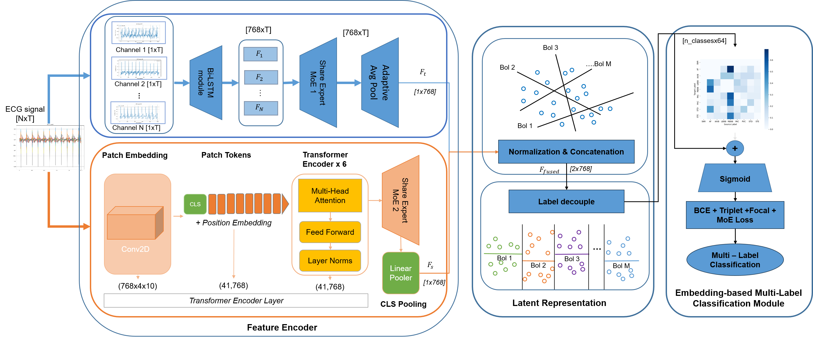
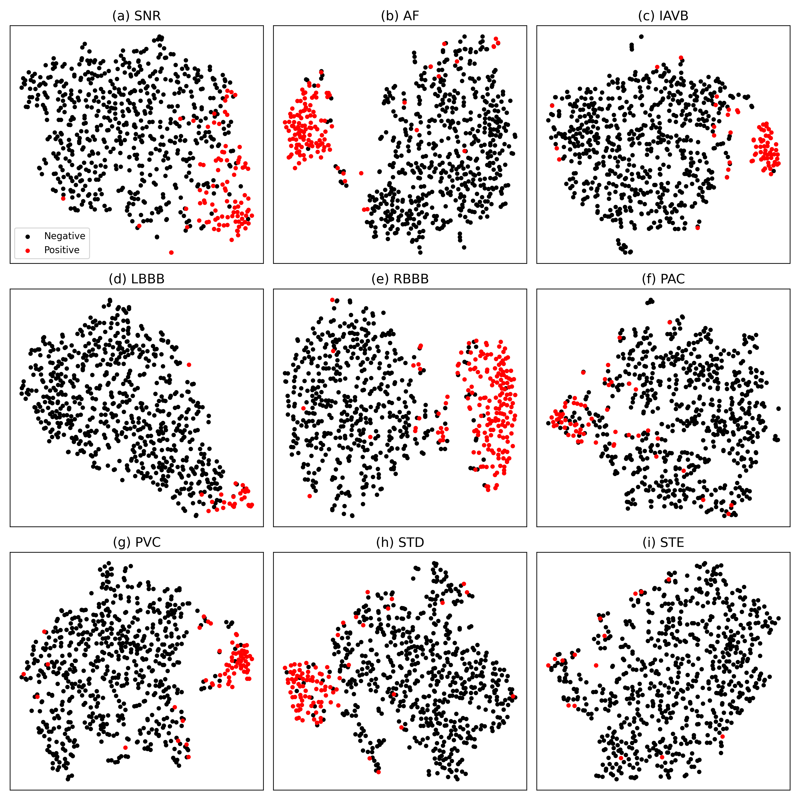

# STLD-Net: A Spatio-Temporal Mixture-of-Experts Framework with Label Decoupling and Co-Occurrence Modeling for Multi-Label ECG Classification

**STLD-Net** is a deep learning framework for **multi-label ECG classification** that jointly models temporal ECG dynamics, spatial inter-lead relationships, and label dependencies.  
The framework integrates a **Spatio-Temporal Mixture-of-Experts (MoE)** architecture with **Label Decoupling** and **Inter-Label Co-Occurrence Modeling** to improve discriminability among correlated cardiac abnormalities.

---

## Key Features

- **Spatio-Temporal ECG Modeling:**  
  Combines temporal sequence modeling and spatial inter-lead representation learning to effectively capture complex ECG characteristics.

- **Share Mixture-of-Experts (MoE):**  
  Employs sparse expert and share expert routing to adaptively specialize across heterogeneous ECG patterns while maintaining computational efficiency.

- **Label Decoupling Module (LDM):**  
  Projects shared ECG representations into independent label-specific subspaces to alleviate inter-label optimization interference during training.

- **Inter-Label Co-Occurrence Modeling:**  
  Preserves clinically meaningful dependencies among cardiac conditions through residual co-occurrence modeling.

- **Multi-Scale Feature Learning:**  
  Captures both local waveform morphology and long-range temporal dependencies for robust ECG interpretation.

- **Backbone-Agnostic Design:**  
  The proposed Label Decoupling and Co-Occurrence modules can be integrated into various ECG backbones.

---



---

## Datasets

STLD-Net has been evaluated on multiple public ECG benchmarks for multi-label cardiac abnormality classification:

### 1. PTB-XL
- Large-scale public 12-lead ECG dataset
- Multi-label annotations for diverse cardiac abnormalities
- Sampling rate: 500 Hz
- Widely used benchmark for automated ECG interpretation

### 2. CPSC2018
- Public multi-lead ECG dataset from the China Physiological Signal Challenge
- Multi-label cardiac rhythm classification task
- Contains diverse arrhythmia categories and signal variations

### 3. Georgia
- Public clinical ECG dataset with multi-label annotations
- Includes various co-occurring cardiac conditions
- Used to evaluate model generalization across datasets

> These datasets are used to validate STLD-Net’s ability to jointly model spatio-temporal ECG features while handling complex inter-label dependencies.

---

## Framework Overview

STLD-Net consists of four major components:

1. **Spatio-Temporal Encoder**
   - Extracts temporal and spatial ECG representations
   - Uses adaptive expert specialization through sparse MoE routing

2. **Label Decoupling Module (LDM)**
   - Learns independent label-aware subspaces
   - Reduces direct inter-label interference

3. **Inter-Label Co-Occurrence Module**
   - Models residual dependencies among diagnostic labels
   - Preserves clinically realistic co-occurrence patterns

4. **Multi-Label Prediction Head**
   - Produces final diagnostic predictions for multiple cardiac conditions

---
## Results



## Installation

```bash
git clone <repository_url>
cd STLD-Net
pip install -r requirements.txt
